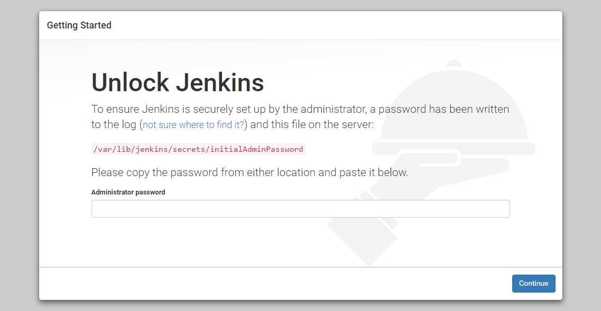

# CI/CD pipeline

**CI/CD, which stands for Continuous Integration and Continuous Deployment (or Continuous Delivery), is a set of practices and automated processes used in software development to ensure efficient and reliable delivery of applications.**

## What value does does it add ?

---

By implementing a CI/CD pipeline, development teams can achieve faster release cycles, reduce the risk of introducing bugs or regressions, and ensure a higher level of quality in their software deployments. It adds business value as it saves a lot of time and resources. 

## Why Jenkins is good for CI/CD?

---

* Ease of use
* Large community support
* Open-source
* Plugin Ecosystem

## Other tools for CI/CD pipeline

---

* **GitLab CI/CD**: GitLab CI/CD is a built-in continuous integration and continuous deployment solution provided by GitLab, a web-based Git repository management tool. It offers an integrated CI/CD pipeline configuration within the same platform, making it a seamless experience.
  
* **CircleCI**: CircleCI is a cloud-based CI/CD platform that focuses on simplicity and speed. It provides a highly customizable and easy-to-configure pipeline setup.

* **Azure DevOps**: Azure DevOps, provided by Microsoft, is a comprehensive suite of development tools that includes CI/CD capabilities.

* **AWS CodePipeline**: AWS CodePipeline is a fully managed CI/CD service provided by Amazon Web Services. It allows you to define and orchestrate your build, test, and deployment pipelines using a visual interface or YAML code.

## Business Value

---

* Faster time-to-market. It help automates complicated tasks within minutes jobs. Faster and efortless software development process

* Less resources and management.

* Improved Collaboration and Transparency: CI/CD promotes collaboration between development, testing, and operations teams

## CI/CD Pipeline with Jenkins and AWS

---


* Jenkins supports webhooks as a means of triggering CI/CD pipelines and jobs based on external events or notifications. Webhooks allow Jenkins to receive HTTP callbacks from external systems or services, notifying it of specific events or changes. When a webhook event occurs, Jenkins can be configured to automatically initiate a pipeline build or trigger a specific job. (Analogy to ordering a food online and receiving updates what's happening with your order).

* We need to generate another pair of SSH keys for jenkins and connect it with github to allow Jenkins cloning repo automatically form github. Public key to github repo and private key to Jenkins.

* **Master Node**: The master node is like the boss of Jenkins. It manages the overall Jenkins system and controls everything. It decides what needs to be done, when it should be done, and who should do it. It stores the instructions and configuration for your pipelines and handles the user interface that you interact with.

* **Agent Node**: Agent nodes are like the workers in Jenkins. They are the machines that actually do the work. When the master node tells them to do something, they perform the assigned tasks. Agent nodes can be separate computers, virtual machines, or containers. They provide the computing power and resources needed to run your builds, tests, and deployments.

In simpler terms, the master node is the brain of Jenkins, managing and organizing everything, while the agent nodes are the muscles, doing the actual work according to the master's instructions. In our case it will be testing the app before deployment.


The master node tells the agent nodes what to do, and they carry out the tasks. This division of work allows Jenkins to handle multiple jobs and distribute the workload across different machines, making the whole process faster and more efficient.

Master Node is separated from Agent Node because in Master all github, production and the rest of things is included. If testing breaks it is separated from Master and helps us to reduce the load from master node. It is also runs on AWS.

* We will need to provide the pem file for our AWS to Jenkins so it has rights to deploy the app on our behalf. Also on our E2C instance we will need to add security rule for Jenkins.

## Creating SSH key pair and adding public key to GitHub

`ssh-keygen -t rsa -b 4096 -C "kf.dudek@gmail.com"` - command to generate ssh key pair

**Add SSH Key to GitHub:**

* Log in to your GitHub account.
  
* Go to "app" repo and then to settings by clicking on your profile picture.
  
* In the left sidebar, click on "Deploy keys"
Click on "New SSH key."

* Give the key a title (e.g., "Jenkins SSH key").
  
* Copy the contents of the public key file and paste it into the "Key" field.
* Click on "Add SSH key" to save it.


# Setting up integration between Jenkins and Github


* Step 1: Coppy HTTPS url from github repo and add it to the project url field


* Step 2: In Source Code Management select 'GIT' and copy SSH url from github repo.
  


* Step 3: Add credentials by copying private key (the pair of the public key from the app repo with the same name and exact content)


* Step 4: Change the branch name for main


* Step 5: In build Environment select provide Node & npm bin/folder to PATH andd choose SParta-Node-JS so it can test our app 


* Step 6: In Office 365 Connector we need to restrict where node agent will test the app to separate it from the Node master


* Step 7: testing commands


* Step 8: Save the job and you are ready to build now to test.

# How to create webhook on GitHub with Jenkins

**Configuring GitHub**

* Step 1: go to your GitHub repository and click on ‘Settings’.

* Step 2: Click on Webhooks and then click on ‘Add webhook’.

* Step 3: In the ‘Payload URL’ field, paste your Jenkins environment URL. At the end of this URL add /github-webhook/. In the ‘Content type’ select: ‘application/json’ and leave the ‘Secret’ field empty.


* Step 4: In the page ‘Which events would you like to trigger this webhook?’ choose ‘Let me select individual events.’ Then, check ‘Pull Requests’ and ‘Pushes’. At the end of this option, make sure that the ‘Active’ option is checked and click on ‘Add webhook’.


**Configuring Jenkins**

* Step 5: In Jenkins, click on ‘New Item’ to create a new project.

* Step 6: Click on the ‘Build Triggers’ tab and then on the ‘GitHub hook trigger for GITScm polling’. Or, choose the trigger of your choice.


**After all of those steps, Jenkins will run the job everytime we will push or pull changes from the app repo**


Job 1:
- create a dev branch on localhost - github
- - make a change to dev branch and push the code to github. change the branch from main to dev
  
Job 2:

- if the tests passes - the code sohuld be merged from dev to main branch

Job 3:

- clone the code from main branch and push to production - aws ec2

end goal is to push once


scp `ssh -o StrictHostKeyChecking=no`

# Creating CI/CD pipeline that deploys app to production after pushing changing from dev branch.

* Step 1: Create a job on that will test the code on dev branch. After code has sucessfully passed the test it will start another job to merch dev branch with main


* Step 2: Create merge job and push the changes to the main branch by using github agent plugin


* Step 3: Job that copies the latest repo to EC2 instance and starts the app on the VM. 

Hint: 

```bash
rsync -avz -e "ssh -o StrictHostKeyChecking=no" app ubuntu@ip:/home/ubuntu
rsync -avz -e "ssh -o StrictHostKeyChecking=no" environment ubuntu@ip:/home/ubuntu
ssh -o "StrictHostKeyChecking=no" ubuntu@ip <<EOF
	sudo bash ./environment/aap/provision.sh
    sudo bash ./environment/db/provision.sh
    cd app
    pm2 kill
    pm2 start app.js
EOF
```


# Installing and running Jenkins from scratch

* Step 1: Creating EC2 instance with SG rule for port 8080 (port where Jenkins is running)


* Step 2: If instance is running just ssh in and install needed dependencies (in this case Java 8 or above)

```bash
sudo apt update

#  install the default Java Runtime Environment (JRE), which will install the JRE from OpenJDK 11
sudo apt install default-jre

# You may need the Java Development Kit (JDK) in addition to the JRE in order to compile and run some specific Java-based software
sudo apt install default-jdk
```

* Step 3: Install Jenkins

```bash
# First, add the repository key to the system:
wget -q -O - https://pkg.jenkins.io/debian-stable/jenkins.io.key | sudo apt-key add -

# When the key is added, the system will return OK. Next, append the Debian package repository address to the server’s sources.list:
sudo sh -c 'echo deb http://pkg.jenkins.io/debian-stable binary/ > /etc/apt/sources.list.d/jenkins.list'

# When both of these are in place, run update so that apt will use the new repository:
sudo apt update

# Install Jenkins
sudo apt install jenkins

# Enabling Jenkins
sudo systemctl enable jenkins

# Starting Jenkins
sudo systemctl start jenkins

```

* Step 4: Configuring Jenkins

**To set up your installation, visit Jenkins on its default port, 8080, using your server domain name or IP address: http://your_server_ip_or_domain:8080**




**password command**

`sudo cat /var/lib/jenkins/secrets/initialAdminPassword` 

* Step 5: Follow the set up pages

* Step 6: Configure github and jenkins
  - In Jenkins settings configure Github plugin to allow connection between our github and jenkins
  - As a credentials I have created an access token on github page


 - In this place we can in the same time creating a webhook:


* Step 7: After all these steps is just a matter to download the correct plugins (In Our case NodeJS and SSH agent) and recreate steps of creating pipeline.


---
